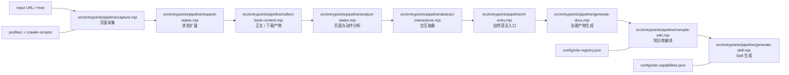
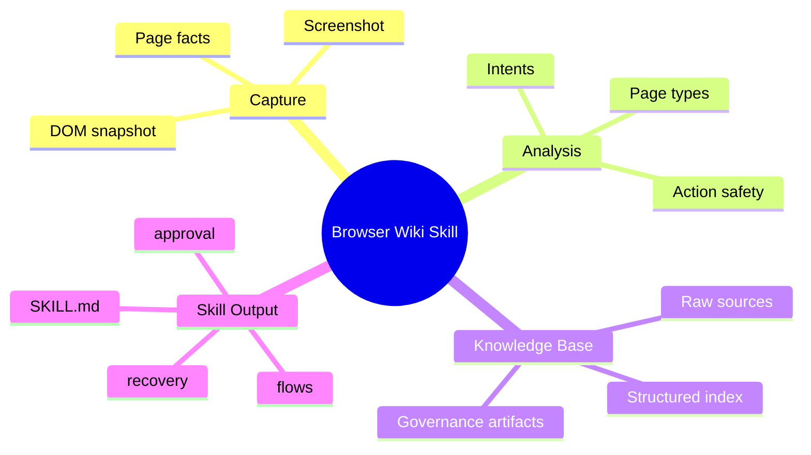

# Browser-Wiki-Skill

<div align="center">

**把站点采集、状态分析、知识库编译与本地 Skill 生成，压成一条可维护、可扩展、可复用的自动化流水线。**

<p>
  
  
  
  
</p>

</div>

---

## Overview

这个仓库的目标不是单点脚本，而是一套站点建模与 Skill 生产系统：

- 从页面采集开始，沉淀结构化状态、意图、文档和知识库
- 用统一的 `config/site-registry.json` 和 `config/site-capabilities.json` 维护站点真值
- 最终产出可在 Codex / 本地工作流中复用的仓库内 Skill 源

它适合这类工作：

- 为新站点快速搭建采集与 Skill 生成链路
- 为已有站点补充 crawler、能力模型和自然语言入口
- 把“临时爬虫脚本”升级成“可维护知识资产”

## Visual Pipeline



## What Makes This Repo Different

<table>
  <tr>
    <td width="33%">
      <h3>Site-as-System</h3>
      <p>不是只抓页面，而是把 host、页型、动作、能力、意图和输出统一建模。</p>
    </td>
    <td width="33%">
      <h3>Pipeline-as-Product</h3>
      <p>每一步都有明确输入输出，方便替换、复用、测试和扩展。</p>
    </td>
    <td width="33%">
      <h3>Skill-as-Artifact</h3>
      <p>最终产物不是零散脚本，而是结构化的仓库内 Skill 源与知识库。</p>
    </td>
  </tr>
</table>

## Supported Sites

Current supported sites snapshot: 20 registered site families across public reading, social, video, and catalog workflows.

| Site | Skill | Archetype | Typical Intents | Status |
| --- | --- | --- | --- | --- |
| `www.22biqu.com` | `22biqu` | chapter-content | 下载整本、打开章节、搜索内容 | 已接入 |
| `www.qidian.com` | `qidian` | chapter-content | 搜索书籍、打开书籍、打开章节、风险/权限面识别 | 已接入 |
| `www.bilibili.com` | `bilibili` | catalog-detail | 打开视频、打开作者、搜索视频 | 已接入 |
| `www.douyin.com` | `douyin` | catalog-detail | 打开视频、打开用户主页、关注更新查询 | 已接入 |
| `www.xiaohongshu.com` | `xiaohongshu-explore` | catalog-detail | 搜索笔记、打开笔记、打开用户主页、下载图文笔记 | 已接入 |
| `x.com` | `x` | social | 只读浏览、搜索、profile/post 读取、媒体队列规划 | 已接入 |
| `www.instagram.com` | `instagram` | social | 只读 profile/media/archive 工作流 | 已接入 |
| `jable.tv` | `jable` | catalog-detail | 打开视频、打开演员页、榜单查询 | 已接入 |
| `moodyz.com` | `moodyz-works` | catalog-detail | 搜索作品、打开作品、打开演员页 | 已接入 |
| `rookie-av.jp` | `rookie-av` | catalog-detail | 列表、详情、搜索、分页、元数据抽取 | 已接入 |
| `madonna-av.com` | `madonna-av` | catalog-detail | 列表、详情、搜索、分页、元数据抽取 | 已接入 |
| `dahlia-av.jp` | `dahlia-av` | catalog-detail | 列表、详情、搜索、分页、元数据抽取 | 已接入 |
| `www.sod.co.jp` | `sod` | catalog-detail | 列表、详情、搜索、分页、元数据抽取 | 已接入 |
| `s1s1s1.com` | `s1` | catalog-detail | 列表、详情、搜索、分页、元数据抽取 | 已接入 |
| `attackers.net` | `attackers` | catalog-detail | 列表、详情、搜索、分页、元数据抽取 | 已接入 |
| `www.t-powers.co.jp` | `t-powers` | profile/catalog | 公开列表、profile/detail 元数据抽取 | 已接入 |
| `www.8man.jp` | `8man` | profile/catalog | 公开列表、profile/detail 元数据抽取 | 已接入 |
| `www.dogma.co.jp` | `dogma` | catalog-detail | 列表、详情、搜索、分页、元数据抽取 | 已接入 |
| `www.km-produce.com` | `km-produce` | catalog-detail | 列表、详情、搜索、分页、元数据抽取 | 已接入 |
| `www.maxing.jp` | `maxing` | catalog-detail | 列表、详情、搜索、分页、元数据抽取 | 已接入 |

长期 AV 发布目录聚合入口：

```powershell
node .\src\entrypoints\sites\jp-av-release-catalog.mjs --start 2026-01-01 --end 2026-05-04
```

该入口只读取官方公开页面，覆盖同构 `/works/date` 站点以及 DAHLIA `/work/`、T-Powers `/release/`、KM Produce `/works?archive=...`、MAXING EUC-JP 公开 shop/top 列表。8MAN、SOD、DOGMA 在作品发行表中会作为明确 skipped/blocked coverage 记录，不会静默漏站或绕过入口边界。

Downloader support is intentionally capability-specific. Many catalog sites are
read-only metadata integrations and explicitly mark downloader workflows as
`not_supported`, `deferred`, or `blocked_by_policy`.

## Capability Snapshot



## Quick Start

### 1. 初始化 PowerShell UTF-8 环境

```powershell
. .\scripts\bootstrap.ps1
```

这会统一：

- PowerShell 输入/输出编码
- `PYTHONIOENCODING`
- `PYTHONUTF8`

### 2. 跑完整流水线

```powershell
node .\src\entrypoints\pipeline\run-pipeline.mjs https://www.22biqu.com/
```

### 3. 单独生成 Skill

```powershell
node .\src\entrypoints\pipeline\generate-skill.mjs https://www.22biqu.com/
node .\src\entrypoints\pipeline\generate-skill.mjs https://moodyz.com/works/date --skill-name moodyz-works
node .\src\entrypoints\sites\site-login.mjs https://www.douyin.com/ --profile-path profiles/www.douyin.com.json --no-headless --reuse-login-state --auto-login
node .\src\entrypoints\sites\site-keepalive.mjs https://www.douyin.com/ --profile-path profiles/www.douyin.com.json --no-headless --reuse-login-state --auto-login
```

抖音默认按“可见浏览器 + 本地持久 profile 复用 + 必要时 WinCred 自动补登录”运行；不要求专属出口 IP，但要求尽量固定在同一条当前网络上。`site-login` 用于首次建立或恢复登录态，`site-keepalive` 用于低频保活与健康确认，在同一份本地 profile 上优先复用登录态，必要时再触发凭证恢复。

## Site Capability Layer

Site Capability Layer keeps site-specific interpretation out of Kernel and downloader code. Kernel/orchestrator owns lifecycle, common safety, schema, and reason semantics. Capability Services own reusable discovery, inventory, API, health, redaction, policy, and coverage mechanisms. SiteAdapter owns URL classification, node/API interpretation, pagination, login/risk signal mapping, and semantic field normalization. Downloader consumes only governed tasks, policies, minimal session views, and resolved resources.

New-site onboarding is full onboarding by default: registry/profile/capability records, SiteAdapter mapping, repo-local skill, discovery artifacts, coverage gate, SiteAdapter contract tests, matrix update, and review acceptance. The required onboarding artifacts are `NODE_INVENTORY`, `API_INVENTORY`, `UNKNOWN_NODE_REPORT`, `SITE_CAPABILITY_REPORT`, and `DISCOVERY_AUDIT`.
## Public Repository Safety

Before publishing to GitHub, keep these boundaries in force:

- Do not commit raw credentials, cookies, CSRF values, authorization headers,
  SESSDATA, tokens, session ids, browser profile directories, or equivalent
  session material.
- Do not commit `.playwright-mcp/`, `runs/`, `book-content/`, browser captures,
  rendered page logs, downloaded media, or local runtime artifacts.
- Do not implement CAPTCHA bypass, MFA bypass, platform-risk bypass,
  access-control bypass, credential extraction, or silent privilege expansion.
- `profiles/*.json` are site capability configuration files in this repository;
  they are not browser profile directories and must stay free of session
  material.

Recommended pre-publish checks:

```powershell
node .\tools\prepublish-secret-scan.mjs
git diff --check
node --test .\tests\node\site-capability-matrix.test.mjs
node --test .\tests\node\site-adapter-contract.test.mjs .\tests\node\site-onboarding-discovery.test.mjs
node --test .\tests\node\site-health-recovery.test.mjs .\tests\node\site-health-execution-gate.test.mjs
node --test .\tests\node\downloads-runner.test.mjs .\tests\node\planner-policy-handoff.test.mjs
```

See [`CONTRIBUTING.md`](./CONTRIBUTING.md) for the full submission checklist,
documentation retention policy, and operational safety gates.

## Breaking Change Migration

Root file retirement is now complete. If you still have callers or notes using
root CLI, root Python, or root metadata paths, migrate them to the canonical
`src/entrypoints/**`, `src/sites/**/python/*.py`, and `config/**` locations.
Do not recreate retired root shims; update the caller instead.

## Download Runner Migration

Download operations move behind the unified runner. The runner is dry-run by default, writes stable `plan.json`, `resolved-task.json`, `manifest.json`, `queue.json`, `downloads.jsonl`, and `report.md` artifacts, and supports `--execute`, `--resume`, and `--retry-failed`. Detailed release, native/legacy, live-validation, and session gates now live in `CONTRIBUTING.md`.

The runner and Site Capability Layer are under active development. Treat the Site Capability Layer matrix and focused regression batch definition in `CONTRIBUTING.md` as the current progress ledger.

BZ888 also has a standalone public-direct script outside the unified downloader:

```powershell
python .\src\sites\bz888\download\python\bz888.py --book-url https://www.bz888888888.com/52/52885/ --out-dir .\book-content\bz888-direct
```

This script reads only public BZ888 HTML, decodes GBK/GB18030 pages, builds a
TXT plus manifest, and stops with `blocked-by-cloudflare-challenge` when the
site serves a Cloudflare challenge. It does not read browser cookies, accept
cookie arguments, use browser profiles, or reuse downloader session material.

## Network Governance (No Dedicated IP)

For Douyin and similar login-gated sites, the operating assumption is **no dedicated IP**. The supported strategy is to keep using the current trusted network consistently, not to rotate exits or depend on a pinned egress address.

- Fixed-current-network strategy: once a local browser profile has a healthy login state, keep `site-login`, `site-keepalive`, `site-doctor`, and `run-pipeline` on that same current network for as long as possible.
- No dedicated IP assumption: the repo can persist browser state, but it does not own or stabilize the egress IP. Treat the current network as an operational dependency, not as something the tooling can guarantee.
- Automatic recovery boundary: WinCred-backed auto-login may be used to restore an expired session, but the browser still runs visibly for Douyin authenticated flows and hard verification pages are not bypassed.
- Keepalive behavior: `site-keepalive` is for gentle reuse of an already-established session on the same local profile and the same network. It is not an IP warming tool or a rotation probe. If the session is expired and stored credentials are available, it can attempt an automatic restore before giving up.
- Quarantine trigger: if a run hits captcha, verify, middle-page, rate-limit, or similar anti-crawl signals, stop reuse attempts for that profile on that network immediately.
- Quarantine scope: quarantine should be treated as applying to the profile-plus-current-network tuple that produced the risk signal. Do not continue unattended keepalive or doctor runs against protected pages while that tuple is quarantined.
- Cooldown semantics: after quarantine, wait through a cooldown window before trying again. Resume with a visible browser on the same network first, then return to automation only after identity is confirmed cleanly.
- Cooldown extension: repeated risk hits should extend the cooldown instead of increasing retry frequency. Fast retries on a non-dedicated IP generally make the risk posture worse.
- Network changes: if Wi-Fi, hotspot, VPN exit, or other egress conditions change, treat the session as higher risk. Re-validate gently from low-risk pages first; if the session is not clearly healthy, fall back to manual login instead of forcing recovery.
- Read-only scope: authenticated Douyin surfaces in this repo stay read-only. Avoid combining keepalive, diagnostics, and broad traversal on a network that is already showing risk signals.

Recommended operator flow under this model:

1. Run `site-login --no-headless --reuse-login-state --auto-login` on the current trusted network.
2. Let the tool reuse the existing profile first; if the session is expired, let it restore from WinCred, and only fall back to manual interaction when the site demands extra verification.
3. Use `site-keepalive` sparingly to keep the session warm; do not use it to probe or migrate networks.
4. If captcha / verify / rate-limit appears, quarantine the profile-network tuple, stop automation, wait through cooldown, and recover manually before resuming.

## Douyin Follow Queries

For authenticated Douyin follow queries, use the dedicated query entrypoint instead of generic page navigation.

- Supported intents: `list-followed-users`, `list-followed-updates`, `prewarm-follow-cache`
- Time windows: `今天`, `昨天`, `本周`, `上周`, `本月`, `上月`, `最近N天`, `YYYY-MM-DD`, `YYYY-MM-DD 到 YYYY-MM-DD`
- Output modes: `summary`, `users`, `groups`, `videos`
- Output formats: `json`, `markdown`
- Filters: `--user`, `--keyword`, `--limit`, `--updated-only`
- Provenance fields: `source`, `timeSource`, `timeConfidence`

Examples:

```powershell
node .\src\entrypoints\sites\douyin-query-follow.mjs https://www.douyin.com/?recommend=1 --intent list-followed-users --output users --format markdown --profile-path profiles/www.douyin.com.json --no-headless --reuse-login-state --auto-login

node .\src\entrypoints\sites\douyin-query-follow.mjs https://www.douyin.com/?recommend=1 --intent list-followed-updates --window 今天 --user "示例用户" --keyword "演唱会" --limit 10 --updated-only --output videos --format markdown --profile-path profiles/www.douyin.com.json --no-headless --reuse-login-state --auto-login

node .\src\entrypoints\sites\site-keepalive.mjs https://www.douyin.com/ --profile-path profiles/www.douyin.com.json --no-headless --reuse-login-state --auto-login --refresh-follow-cache --recent-active-days 3 --recent-active-users-limit 48
```

## Common Commands

### 下载整本小说

```powershell
& 'C:\Users\lyt-p\AppData\Local\Microsoft\WinGet\Packages\PyPy.PyPy.3.11_Microsoft.Winget.Source_8wekyb3d8bbwe\pypy3.11-v7.3.20-win64\pypy3.exe' '.\src\sites\chapter-content\download\python\book.py' 'https://www.22biqu.com/' --book-title '玄鉴仙族'
```

### 强制重新抓取

```powershell
& 'C:\Users\lyt-p\AppData\Local\Microsoft\WinGet\Packages\PyPy.PyPy.3.11_Microsoft.Winget.Source_8wekyb3d8bbwe\pypy3.11-v7.3.20-win64\pypy3.exe' '.\src\sites\chapter-content\download\python\book.py' 'https://www.22biqu.com/' --book-title '玄鉴仙族' --force-recrawl
```

### 生成或复用站点 crawler

```powershell
node .\src\entrypoints\pipeline\generate-crawler-script.mjs https://www.22biqu.com/
```

### 下载小红书图文笔记

```powershell
node .\scripts\xiaohongshu-action.mjs download "穿搭" --dry-run
node .\scripts\xiaohongshu-action.mjs download "https://www.xiaohongshu.com/explore/646f34fd000000001300755c"
```

### 运行测试

```powershell
node --test .\tests\node\*.test.mjs
python -m unittest discover -s .\tests\python -p 'test_*.py'
```

## Core Layout

| Path | Role |
| --- | --- |
| [`src/`](./src) | Primary code tree for entrypoints, pipeline orchestration, site modules, skill generation internals, infra, and shared helpers |
| [`tools/`](./tools) | Maintenance-only scripts such as migrations, benchmarks, and bootstrap helpers |
| `runs/` | Transient runtime outputs for pipeline runs, site diagnostics, queries, benchmarks, and scratch artifacts; runtime-created and usually absent from a clean checkout |
| [`profiles/`](./profiles) | 站点级规则源，每个 host 一个 profile |
| [`crawler-scripts/`](./crawler-scripts) | 按 host 缓存 crawler 脚本与元数据 |
| [`knowledge-base/`](./knowledge-base) | 编译后的知识库与 `raw/` 事实归档 |
| [`book-content/`](./book-content) | 下载缓存与正文产物 |
| [`skills/`](./skills) | 仓库内维护的 Skill 源文件 |
| [`schema/`](./schema) | 知识库与文档治理规则 |
| [`tests/`](./tests) | Node / Python 回归测试 |

## Project Layout

The repo is now `src-first`: implementation code lives under `src/`, while truth/config directories and generated artifacts stay at the repository root.

- `src/entrypoints/`: canonical CLI entrypoints for pipeline stages and site operations.
- `src/pipeline/`: pipeline engine, artifact resolution, runtime composition, and per-stage implementations.
- `src/sites/`: site catalog access, site core modeling, and site-specific modules such as Douyin/Bilibili diagnosis, queries, routing, and download logic.
- `src/skills/`: skill-generation input/model/render/output/publish internals.
- `src/infra/`: browser runtime, auth/keepalive/session governance, CLI/file/process helpers.
- `src/shared/`: pure shared helpers for normalization, markdown, wiki/report paths, and other small utilities.
- `tools/`: maintenance-only scripts; migrations, benchmarks, and bootstrap helpers live here instead of under `scripts/`.
- `tools/clean-transient-outputs.mjs`: repeatable safe cleanup for transient runtime outputs and stray `__pycache__/` directories.
- `tools/compat-retirement-inventory.md`: inventory of compatibility layers that should stay for now vs. retire later.
- `runs/`: transient runtime outputs; pipeline runs, site diagnostics, query exports, benchmarks, and scratch artifacts converge here.
- `lib/` and `downloaders/` have been retired from the internal dependency graph; canonical implementations now live directly under `src/`.
- root truth/config directories stay at the repository root: `profiles/`, `schema/`, `config/`.
- generated/published outputs stay at the repository root: `crawler-scripts/`, `knowledge-base/`, `book-content/`, `skills/`.
- long-lived consumer outputs stay at the repository root: `video-downloads/`.
- transient runtime artifacts are converging under `runs/`; legacy root directories such as `captures/`, `expanded-states/`, `state-analysis/`, `interaction-abstraction/`, `nl-entry/`, `operation-docs/`, `governance/`, and `archive/` remain read-compatible during migration.
- root compatibility entrypoints are retired; the stable CLI surface now lives directly under `src/entrypoints/`.
- root Python entrypoints are retired; call the canonical internal Python modules under `src/sites/**/python/` directly.

## Source Layout (src-first)

`src-first` in this repo means **code moves into `src/`**, while root keeps directories for truth/config and generated/runtime artifacts only.

- `src/entrypoints/` is the only place that should parse CLI flags and print user-facing summaries.
- `src/pipeline/` owns stage contracts, manifest/artifact resolution, and orchestration internals.
- `src/sites/` owns site modeling and site-specific behavior; site modules should not depend on pipeline stage files.
- `src/skills/` owns skill generation internals; it consumes structured outputs instead of talking directly to browser runtime.
- `src/infra/` and `src/shared/` stay generic and must not depend on concrete site modules.

Root retirement policy:

- root `*.mjs` stage files are removed
- `scripts/*.mjs` and `scripts/<site>/*.mjs` remain as importable/executable shims when they provide site operations outside the root
- `scripts/` is compat-only; new operational scripts go under `tools/`, and new CLI entrypoints go under `src/entrypoints/`
- root `download_*.py` and `site_context.py` files are removed
- transient outputs should write to `runs/` instead of creating new root-level scratch directories
- the semantic source of truth for sites lives at `config/site-registry.json` and `config/site-capabilities.json`

Examples:

- `src/sites/douyin/`
  - `model/site.mjs`
  - `model/diagnosis.mjs`
  - `queries/follow-query.mjs`
  - `queries/media-resolver.mjs`
  - `download/enumerator.mjs`
  - `actions/router.mjs`
- `src/sites/bilibili/`
  - `model/diagnosis.mjs`
  - `model/surfacing.mjs`
  - `navigation/open.mjs`
  - `navigation/extract-links.mjs`
  - `actions/router.mjs`

Shared infrastructure now lives in `src/infra/`, while site-specific code is grouped under `src/sites/` instead of being scattered across the repo root.

## Source of Truth

| File | Purpose |
| --- | --- |
| [`config/site-registry.json`](./config/site-registry.json) | 记录 host、知识库路径、Skill 路径、crawler 路径和最近一次下载/编译信息 |
| [`config/site-capabilities.json`](./config/site-capabilities.json) | 记录 archetype、page types、capability families、supported intents、safe/approval actions |

## Add a New Site

新站点扩展建议沿着这条路径推进：

1. 先补 `profiles/<host>.json` 或站点 archetype 所需配置
2. 生成或复用 crawler：[`src/entrypoints/pipeline/generate-crawler-script.mjs`](./src/entrypoints/pipeline/generate-crawler-script.mjs)
3. 跑通采集与知识库编译：[`src/entrypoints/pipeline/run-pipeline.mjs`](./src/entrypoints/pipeline/run-pipeline.mjs)
4. 生成仓库内 Skill：[`src/entrypoints/pipeline/generate-skill.mjs`](./src/entrypoints/pipeline/generate-skill.mjs)
5. 用 `CONTRIBUTING.md` 的 new-site onboarding gate、Site Capability Layer matrix 和 focused regression batch 回归检查

## Repo Notes

<details>
<summary><strong>运行与产物说明</strong></summary>

- `src/sites/chapter-content/download/python/book.py` 是小说下载的 canonical Python 入口
- `src/sites/bilibili/download/python/bilibili.py` 负责 bilibili 下载相关能力
- `book-content/` 默认按 host 落盘，例如 `book-content/www.22biqu.com/...`
- 运行时优先复用本地完整 artifact；缺失时再复用或生成 crawler
- `skills/` 是仓库内维护源，真正给 Codex 使用的安装目录在 `.codex/skills/`

</details>

<details>
<summary><strong>适合放在 GitHub 首页的阅读顺序</strong></summary>

1. 先看上面的 Pipeline 图，理解整条链路
2. 再看 `Supported Sites`，确认当前能力面
3. 然后从 `Quick Start` 跑一次最短路径
4. 最后再深入 `profiles/`、`knowledge-base/` 和 `skills/`

</details>

---

## Build Skills, Not Just Scripts

这个仓库最终想沉淀的，不是“一次性站点脚本”，而是可以持续演化的站点知识、能力模型和本地 Skill 生产能力。
